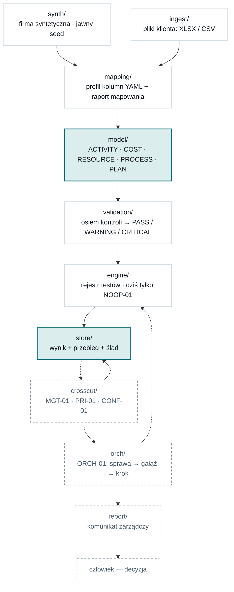

# Schemat architektury fundamentu X-Ray

Produkt 3 z ZOP-TECH-01 rozdz. 7. Mapa komponentów i przepływu danych.

**Ten plik jest źródłem kanonicznym.** Istnieje też kopia prezentacyjna jako strona HTML
(łatwiejsza w czytaniu na telefonie, przekazywana Michałowi). Gdy oba się rozjadą,
obowiązuje ten plik.

Stan na 7 września 2026: 362 testy, `ruff` czysty, `python -m xray.demo` przechodzi
łańcuch od generatora do odczytu z magazynu.

---

## 1. Przepływ

Dane idą w jedną stronę. Warstwa niższa nigdy nie importuje wyższej, a jedyną walutą
między warstwami są modele z `model/`.



Linia ciągła — zbudowane i przetestowane. Linia przerywana — kontrakt spisany, kod przed
nami. Wyróżnione — dwa szwy.

Trzy dolne warstwy są przerywane świadomie: karty PRI-01, CONF-01 i ORCH-01 są zamrożone
i gotowe, ale ich implementacja należy do etapów 2 i 3. Fundament ma je **unieść**, a nie
udawać, że już je wykonuje.

Dwie pętle zwrotne — `next_tests` i wzbogacenie wyniku o priorytet i pewność — przechodzą
przez **magazyn**, nie przez wywołanie funkcji. To nie jest szczegół implementacyjny:
gdyby biegły przez wywołanie, orkiestracja i warstwy przekrojowe stałyby się częścią
silnika, a ślad ich decyzji przestałby istnieć.

---

## 2. Dwa szwy

Cała reszta architektury jest wymienna. Te dwa miejsca — nie.

### Szew 1 — kontrakt danych (`model/`)

Powyżej: wszystko, co jest inne u każdego klienta — nazwy kolumn, formaty plików, arkusze,
strefy czasowe. Poniżej: **nic nie wie, z jakiego pliku przyszła liczba.**

Nowy klient to nowy profil mapowania, a nie nowa gałąź kodu.

### Szew 2 — FINDINGS (`store/`)

Jedyne miejsce zapisu wyników. Nikt nie liczy niczego „obok".

Wynik jest kluczowany parą `(finding_id, run_id)`. Dwa wiersze o tym samym `finding_id`
i różnym `run_id` to **dwie odpowiedzi na to samo pytanie**, dane w różnych momentach na
różnych danych — więc powtórzenie analizy na poprawionych danych nie kasuje poprzedniej
odpowiedzi. Po `finding_id` da się prześledzić historię jednego wyniku przez kolejne
przebiegi.

---

## 3. Dwie rzeczy, których nie widać w strukturze katalogów

Oba mechanizmy istnieją w kodzie i oba łatwo narysować niepełnie.

### Ślad pochodzenia biegnie **obok** kontraktu, nie w nim

```
liczba w FINDINGS
  → run_id                    który przebieg ją wyprodukował
  → ImportReport              raport importu tabeli, z której pochodzi
  → row_id                    indeks rekordu w ramce
  → source_id + file_row      plik klienta i numer wiersza w nim
```

Kontrakt danych **nie ma pola** na nazwę pliku ani numer wiersza. Gdyby miał, każdy rekord
niósłby swoje pochodzenie i ten sam zbiór zapisany jako CSV oraz jako XLSX byłby dwoma
różnymi zbiorami. Pochodzenie żyje w raporcie importu, równolegle do ramki, i łączy się
z nią przez `row_id`.

Konsekwencja praktyczna: **przeformatowanie pliku nie jest zmianą danych.** Ten sam zbiór
w CSV i w XLSX daje ten sam skrót treści, ten sam `run_id` i idempotentny zapis.

### Tożsamość przebiegu spotyka trzy warstwy w jednej wartości

`run_id` powstaje ze skrótu krotki, której składniki pochodzą z trzech różnych miejsc:

| Składnik | Skąd | Co znaczy |
| --- | --- | --- |
| `content_digest` per tabela | `ingest/` | treść przyjętych rekordów, liczona przyrostowo przy imporcie |
| `profile_digest` | `mapping/` | znacząca treść profilu: użyte przypisania, deklaracje miar planu, strefa |
| `contract_version`, wersja tożsamości | `model/` | jak zbudowano rekordy i jak policzono ich identyfikatory |

To jedyne miejsce, w którym te trzy warstwy spotykają się w jednej wartości.

Dwa rozstrzygnięcia, bez których byłoby to niepoprawne:

- **`source_id` nie wchodzi do tożsamości**, tylko do pochodzenia. Niesie nazwę pliku,
  a nazwa pliku nie wpływa na wynik.
- **Znacząca treść profilu wchodzi**, choć nie zmienia treści żadnego rekordu. Deklaracja
  zgodności miar planu zmienia to, czy PLAN może służyć jako referencja — więc zmienia
  wynik. Bez niej ten sam `run_id` niósłby inną treść, a magazyn ogłosiłby, że przepływ
  nie jest deterministyczny, choć jest.

---

## 4. Warstwy i ich odpowiedzialność

Kolumna „co ją zmienia" jest sprawdzianem granicy: jeżeli jedna przyczyna zmienia dwie
warstwy, granica jest poprowadzona źle.

| Pakiet | Odpowiedzialność | Co ją zmienia | Stan |
| --- | --- | --- | --- |
| `ingest/` | odczyt XLSX i CSV → ramka w kontrakcie + raport importu | nowe źródło danych | gotowe |
| `mapping/` | profil kolumn klienta (YAML), raport mapowania | nowy klient | gotowe |
| `model/` | kontrakt danych i FINDINGS — jedno źródło prawdy o polach | zmiana karty zamrożonej | gotowe |
| `validation/` | rejestr ośmiu kontroli, statusy z podstawą | nowa kontrola w karcie | gotowe |
| `engine/` | rejestr testów diagnostycznych i bramka gotowości | nigdy — testy dochodzą obok | rejestr i bramka gotowe, testów brak |
| `store/` | trwały zapis wyników i śladu (SQLite) | zmiana silnika bazy | gotowe |
| `synth/` | generator firmy syntetycznej, deterministyczny | nowy scenariusz | gotowe |
| `crosscut/` | MGT-01, PRI-01, CONF-01 nad gotowymi wynikami | zmiana standardu przekrojowego | puste |
| `orch/` | sprawa, gałąź, krok, maszyna stanów | zmiana ORCH-01 | puste |
| `report/` | komunikat zarządczy i eksport | nowa forma raportu | puste |

---

## 5. Osiem kontroli jakości danych

Walidator sam niczego nie blokuje — **ogłasza statusy**. To test diagnostyczny deklaruje,
które kontrole są dla niego wymagane i co oznacza ich CRITICAL.

„Sufit" to najmocniejszy status, jaki kontrola w ogóle może ogłosić. Rejestr tego pilnuje:
kontrola, która spróbuje ogłosić więcej, jest błędem implementacji wyłapywanym w rejestrze,
a nie cichym zaostrzeniem oceny.

| Nr | Kontrola | Sufit | Dlaczego taki |
| --- | --- | --- | --- |
| 1 | brak wymaganej kolumny | CRITICAL | **tylko** element klucza naturalnego; brak dowolnego innego pola → PASS z obserwacją (B-06) |
| 2 | nieprawidłowy format wartości | WARNING | liczone z odrzuceń importu — rekord odrzucony nigdy nie dotarłby do walidatora |
| 3 | brakujące wartości | PASS | to obraz danych, nie werdykt; `null` jest poprawnym wynikiem |
| 4 | duplikaty klucza | CRITICAL | w tabeli zdarzeniowej tylko WARNING — PROC-02 zna powtórne wizyty |
| 5 | wartości podejrzane | WARNING | ujemna kwota bywa korektą: sygnał, nie błąd |
| 6 | niespójne nazwy jednostek | WARNING | „Dział A" i „DZIAL_A" to hipoteza tożsamości, nie fakt |
| 7 | wykorzystanie ponad dostępność | WARNING | nadgodziny są udokumentowanym przypadkiem; rozstrzyga CAP-01 |
| 8 | zakres czasowy | WARNING | w tabeli zdarzeniowej PASS — bez rozstrzygnięcia `time_basis` luka nie jest luką |

Kontrola potrafi też **odmówić oceny**. Jeżeli dwa pola, których różnica niesie jej sygnał,
pochodzą z jednej kolumny klienta, różnicy nie da się zobaczyć — kontrola zwraca wtedy
`not_assessable` z podstawą, zamiast wypisać PASS, który byłby jedyną możliwością.

**Kontrole 1 i 3 należą do jednego gatunku: dają obraz, nie werdykt.** Obie ogłaszają stan
danych i obie mają wysoko postawiony sufit, z którego nie korzystają poza jednym
przypadkiem. Powód jest ten sam i pochodzi z rozstrzygnięcia B-06:

> „Walidator danych ogłasza stan danych, ale nie przejmuje metodologicznej
> odpowiedzialności testu diagnostycznego. To konsument informacji wie, czy dane pole jest
> konieczne do wydania określonego twierdzenia."

Brak kolumny spoza klucza nie czyni tabeli niepoprawną — ogranicza **ten test**, który tego
pola potrzebuje. Ciężar nadaje odbiorca, a nie walidator.

Odbiorcą jest **bramka gotowości** w `engine/`. `DiagnosticTest.execute` sprawdza
`required_by_test` wobec rzeczywistych raportów importu i albo woła `run`, albo zwraca
jeden wynik ze statusem `TEST_BLOCKED`. Wtyczka nie może bramki ominąć: nadpisanie
`execute` albo `readiness` jest odrzucane przy tworzeniu klasy.

Odmowa jest zapisywana jak każdy inny wynik i ma **ten sam** `finding_id` co policzony
wynik z późniejszego przebiegu — różni je `run_id`. To pierwszy realny użytkownik klucza
magazynu złożonego z pary. Rekordów odmowy nie wolno usuwać: bez nich ślad milczałby o tym,
że w poprzednim przebiegu nie było czym liczyć. Wpis DT-20.

---

## 6. Czego fundament świadomie nie robi

Wymienione, żeby nie trzeba było tego wnioskować z nieobecności. Ta sama zasada, którą
stosuje sam system: brak ma być **ogłoszony**.

| | |
| --- | --- |
| **nie stawia diagnoz** | jedyny zarejestrowany test to NOOP-01 — atrapa licząca wiersze. Żaden test z Core 10 nie jest zaimplementowany |
| **nie nadaje priorytetów ani pewności** | struktura FINDINGS ma pola PRI-01 i CONF-01 i potrafi je unieść, ale nic ich nie wypełnia. `confidence_score` jest typem dopuszczającym wyłącznie `null` |
| **nie prowadzi ścieżki analizy** | ORCH-01 to karta zamrożona bez kodu. `next_tests` to dziś zawsze pusta krotka |
| **nie dotyka danych rzeczywistych** | wyłącznie generator syntetyczny; repozytorium nie zawiera żadnego zbioru danych |
| **nie używa modelu językowego** | zero AI w rdzeniu — nie wytwarza podstaw dowodowych, nie wypełnia luk, nie nadaje klas |
| **nie modeluje kalendarzy operacyjnych** | dostępność zasobu to stała miesięczna; kalendarze i `time_basis` pozostają kontraktem otwartym |

---

## 7. Otwarte kontrakty

Kontrakt otwarty to pytanie, które odsłoniła implementacja — **nie zastrzeżenie do
metodologii**. Do czasu rozstrzygnięcia kod jawnie oznacza założenie komentarzem
`# ASSUMPTION:` i nie udaje, że sprawa jest domknięta.

Pełna treść: `docs/otwarte-kontrakty.md`.

### Czeka na decyzję Michała

**B-06 — co znaczy „kolumna wymagana".** TECH-01 pkt 5.3 sugeruje CRITICAL dla każdego
brakującego pola; CAP-01 pkt 4.1 wprost dopuszcza brak `cost`. Hierarchia kart rozstrzyga
kierunek, ale nie kryterium. Propozycja robocza: element klucza naturalnego → CRITICAL,
pole spoza klucza → WARNING. Nic nie blokuje.

### Rozstrzygnięte 5 września

A-01 (etykieta okresu dla procesu — nie rozstrzygamy `time_basis` w ogóle), B-01 (korekty
są sygnałem, nie błędem), B-02 i B-03 (słowniki statusu i klasy pewności — wrócą jako
poprawki do TECH-01 v0.2), B-04 (fundament **wymaga** jawnej deklaracji zgodności miar
planu), B-05 (dowód wiąże się z twierdzeniem wiele-do-wielu).

### Otwarte świadomie w MASTER v1.2 — nie zgłaszamy jako braku

`work_content`; `activity_unit` i `weighted_volume`; alokacja kosztów wspólnych; kalendarze
operacyjne i `time_basis`; globalna polityka istotności biznesowej.

---

## 8. Sprawdzenie na własne oczy

```
python -m xray.demo
```

Demonstracja generuje firmę syntetyczną w katalogu tymczasowym i przeprowadza ją przez
cały łańcuch. Najważniejszy wiersz wyjścia:

```
   PROCESS — rozróżnienie z rozstrzygnięcia A-01:
       months_with_stage_starts   = 24
       months_with_stage_ends     = 25
       time_basis_used            = —
```

System **nie rozstrzyga**, do którego miesiąca należy proces trwający przez granicę
miesiąca, i mówi to wprost, zamiast wybrać po cichu. Tak wygląda rozstrzygnięcie A-01
wykonane w kodzie.
